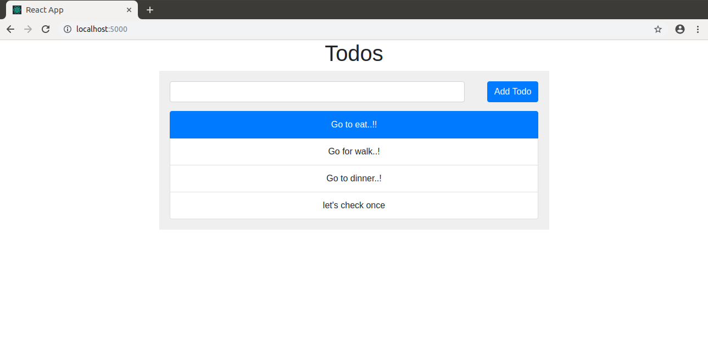

# This project is a playground for [Docker ECS plugin](https://github.com/docker/awesome-compose/tree/master/react-express-mongodb)
## It uses a [Compose sample application](https://github.com/docker/awesome-compose/tree/master/react-express-mongodb)
### React application with a NodeJS backend and a MongoDB database

Project structure:
```
.
├── backend
│   ├── Dockerfile
│   ...
├── docker-compose.yaml
├── frontend
│   ├── ...
│   └── Dockerfile
└── README.md
```

[_docker-compose.yaml_](docker-compose.yaml)
```
services:
  frontend:
    build:
      context: frontend
    ...
    ports:
      - 5000:5000
    ...
  server:
    container_name: server
    restart: always
    build:
      context: server
      args:
        NODE_PORT: 3000
    ports:
      - 3000:3000
    ...
    depends_on:
      - mongo
  mongo:
    container_name: mongo
    restart: always
    ...
```
The compose file defines an application with three services `frontend`, `backend` and `db`.
When deploying the application, docker-compose maps port 5000 of the frontend service container to port 5000 of the host as specified in the file.
Make sure port 5000 on the host is not already being in use.

## Local deploy with docker-compose for dev & test

```
$ docker-compose up -d
Creating network "react-express-mongodb_default" with the default driver
Building frontend
Step 1/9 : FROM node:13.13.0-stretch-slim
 ---> aa6432763c11
...
Successfully tagged react-express-mongodb_app:latest
WARNING: Image for service app was built because it did not already exist. To rebuild this image you must use `docker-compose build` or `docker-compose up --build`.
Creating frontend        ... done
Creating mongo           ... done
Creating app             ... done
```

### Expected result

Listing containers must show containers running and the port mapping as below:
```
$ docker ps
CONTAINER ID        IMAGE                               COMMAND                  CREATED             STATUS                  PORTS                      NAMES
06e606d69a0e        react-express-mongodb_server        "docker-entrypoint.s…"   23 minutes ago      Up 23 minutes           0.0.0.0:3000->3000/tcp     server
ff56585e1db4        react-express-mongodb_frontend      "docker-entrypoint.s…"   23 minutes ago      Up 23 minutes           0.0.0.0:5000->5000/tcp     frontend
a1f321f06490        mongo:4.2.0                         "docker-entrypoint.s…"   23 minutes ago      Up 23 minutes           0.0.0.0:27017->27017/tcp   mongo
```

After the application starts, navigate to `http://localhost` in your web browser.



Stop and remove the containers
```
$ docker-compose down
Stopping server   ... done
Stopping frontend ... done
Stopping mongo    ... done
Removing server   ... done
Removing frontend ... done
Removing mongo    ... done
```

## Changes made to [original project](https://github.com/docker/awesome-compose/tree/master/react-express-mongodb) to get it working with [Docker-ECS-plugin](https://docs.docker.com/engine/context/ecs-integration/)
### Note: Most changes were related to getting the react app to play nice. I have tagged these as #react app specific below

- docker-compose.yml:
  - upped version to 3.8
  - Added image attributes to frontend and backend services. We need to push these images to a docker repo (e.g,. Docker Hub) because ECS cannot see your local image cache
  - Added `tty: true` attribute to frontend as the dev server started by `react-scripts start` exits with code 0 in the ECS task otherwise. #react app specific
  - Removed volume declarations. I found that `docker compose up --context ecs` throws an error for shorthand volume syntax. Perhaps this is a bug in the current (beta) version
- backend/scripts/ and frontend/scripts/entrypoint.sh files:
  - in both backend and frontend folders added a scripts/entrypoint.sh file.
- backend/Dockerfile and frontend/Dockerfile:
  - added scripts/entrypoint.sh script as ENTRYPOINT to both images Dockerfile. See [this for an explanation](https://github.com/docker/ecs-plugin#networking)
- frontend/package.json: #react app specific
  - downgraded react-scripts to 3.4.0 [because of this](https://github.com/facebook/create-react-app/issues/8688)
  - Added http-proxy-middleware and removed "Proxy" statement to take care of "Invalid Host Header" Errors After Configuring Proxy when accessing the frontend via ELB
  - Changed `npm start` to "start": "export PORT=80 && react-scripts start" to expose frontend on port 80 (this is because my AWS account has AWS Config rules that only allows ports 80 & 443 to be exposed to 0.0.0.0)
- Added frontend/src/setupProxy.js [as per this](https://create-react-app.dev/docs/proxying-api-requests-in-development/#configuring-the-proxy-manually) #react app specific

## [Deploying to ECS](https://docs.docker.com/engine/context/ecs-integration/)
### [See architectural explanation here](https://github.com/docker/ecs-plugin#architecture)

- Download and install Docker Desktop Edge version 2.3.3.0 or later
- `docker-compose build`
- `docker login`
- `docker-compose push` #Push images to Docker Hub for ECS (ECS cannot see your local image cache)
- Set up federated login on aws cli and export profile ([gsts](https://github.com/ruimarinho/gsts) & export AWS_PROFILE=contino-role-kmkale) #This is specific to my situation
- `docker context create ecs testecs --profile contino-role-kmkale --region ap-southeast-2` #This creates a new Docker context named testecs. Once setup, the AWS profile and region are stored in the Docker context
- `docker compose up --context testecs` #This deploys the application to ECS Fargate


